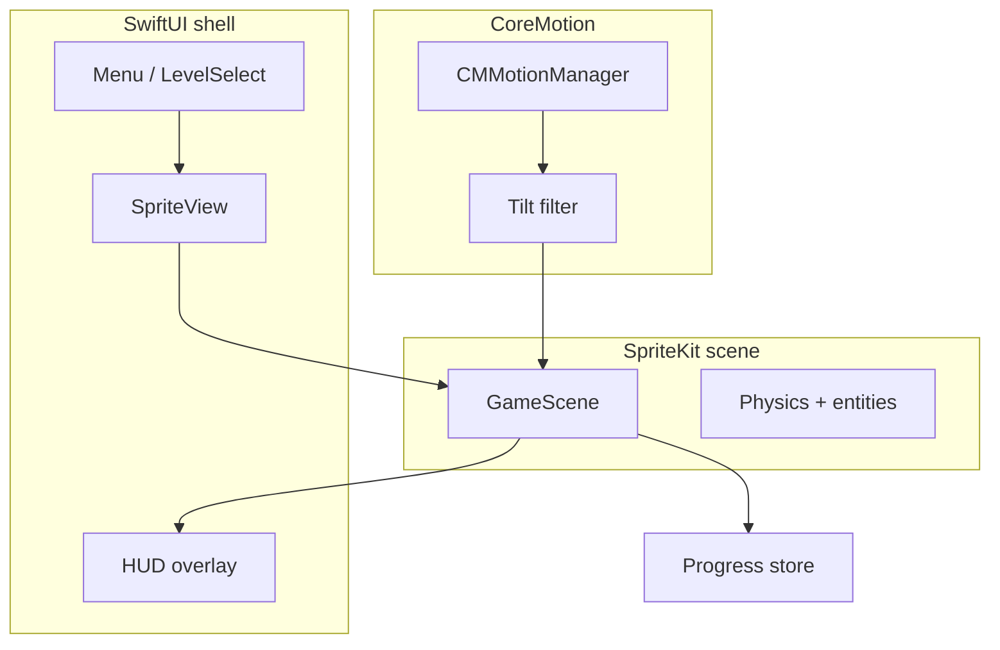

# Tight Rope Car

Drive a car across a tight rope. Tilt your iPhone or iPad left and right to balance — lean too far and you fall.

## Concept

You are a car inching forward along a rope high above the ground. The only control is **balance**: tilting the device left makes the car lean and drift left; tilting right does the opposite. Stay centered, keep your pitch stable, and reach the end (or go as far as you can) without tumbling off.

## Controls

| Input | Effect |
|-------|--------|
| Tilt left | Car leans / moves left on the rope |
| Tilt right | Car leans / moves right on the rope |
| Hold level | Neutral balance (calibrated at level start) |

A physical device is recommended for playtesting; the Simulator has limited motion simulation.

## Core gameplay loop

| Phase | Behavior |
|-------|----------|
| **Start** | Car spawns on the rope; brief calibration (“hold your device level”) |
| **Play** | Continuous forward motion; player corrects roll via tilt |
| **Fail** | Center of mass leaves the rope, or pitch exceeds stability threshold |
| **Success** | Cross the finish line; score by time, distance, and stability |

## Planned features

### MVP (v0.1)

- [ ] Single endless or short level
- [ ] CoreMotion tilt input with dead zone and smoothing
- [ ] 2D side view: car sprite, rope, simple parallax background
- [ ] Fall detection, restart, best distance/score on device

### v0.2 — Game feel

- [ ] Haptics on near-fall and fall (Core Haptics)
- [ ] Sound: engine, rope creak, fall sting (AVFoundation)
- [ ] Wind gusts as periodic lateral force
- [ ] Rope sag and slight sway

### v0.3 — Progression

- [ ] Level select: rope length, gaps, narrower rope
- [ ] Star rating (time, max tilt, falls)
- [ ] Local persistence (high scores, unlocked levels)

### Later (optional)

- [ ] Game Center leaderboards and achievements
- [ ] iCloud sync for progress
- [ ] Accessibility: on-screen left/right balance (no tilt required)
- [ ] iPad: larger play area; landscape-first layout

## Game design notes

These constants keep implementation and tuning aligned:

- **Input mapping** — Device roll (gamma) drives a *target lean angle*, not raw position. Apply a low-pass filter (~10–20 Hz) so small hand jitter does not wobble the car.
- **Auto-forward** — Constant base speed in v1; tilt affects lateral position and balance on the rope, not a gas pedal.
- **Stability** — Track pitch and lateral offset; exceeding half the rope width or a max pitch angle triggers a fall.
- **Difficulty knobs** — Rope width, wind amplitude, forward speed, rope sway frequency, visual vs hitbox wheelbase.
- **Fairness** — Calibrate neutral tilt at level start; pause stops motion updates.

## Level backgrounds

Levels can use different visual environments (ocean, forest, city, bedroom, toy shop, candy shop, garden, beach). Theme identity and rendering metadata live in `BackgroundTheme` and `BackgroundThemeCatalog` under `Tight Rope Car/Models/`. All 24 parallax layers are in the asset catalog (imported from `Graphics/` via `scripts/import_parallax_graphics.sh`). On the landing screen, tap **Backgrounds** to open the theme gallery and preview parallax in the Simulator. See [docs/background-themes.md](docs/background-themes.md) and [docs/background-art.md](docs/background-art.md).

## Technical architecture

The project is a native **iOS / iPadOS** app (Swift, SwiftUI app shell). The Xcode template currently includes placeholder SwiftData UI; that will be replaced by the game scene described below.



### Recommended systems

| Concern | Choice | Why |
|---------|--------|-----|
| **Rendering** | SpriteKit (`SpriteView` + `SKScene`) | 2D sprites, built-in physics, side-view rope game |
| **Input** | CoreMotion (`CMMotionManager`, device attitude) | Native tilt on iPhone and iPad |
| **Game loop** | SpriteKit `update(_:)`; HUD via SwiftUI overlay | Fixed-step simulation; menus stay in SwiftUI |
| **Physics** | SpriteKit bodies and joints, or custom 1D rope constraint for MVP | Collisions via SK; rope as lateral clamp + pitch may be simpler custom first |
| **UI / menus** | SwiftUI (existing app entry) | Settings, level select, pause over `SpriteView` |
| **Persistence** | Codable + FileManager, or SwiftData for progress only | Not for per-frame game state |
| **Audio** | AVAudioPlayer or AVAudioEngine | Lightweight SFX |
| **Haptics** | Core Haptics | Near-miss and fall feedback |
| **Testing** | XCTest for simulation math; UI tests for launch/menu | Physics testable without motion hardware |

### Not planned for v1

- SceneKit / RealityKit (3D is unnecessary for the core fantasy)
- SwiftData for real-time game state
- Custom Metal renderer unless art demands it
- Analytics or crash reporting (defer until shipping)

## Getting started

### Requirements

- Xcode with the iOS 26.5 SDK (matches the project deployment target)
- iPhone or iPad for tilt testing

### Open the project

```bash
open "Tight Rope Car.xcodeproj"
```

Build and run on a device. Use **Product → Run** with your phone selected as the destination.

## Project status

Early scaffold: SwiftUI + SwiftData template. Next implementation step is a SpriteKit game scene with CoreMotion tilt and basic fall/restart loop (MVP above).

## License

MIT License — see [LICENSE](LICENSE).

## Contributing

Issues and pull requests are welcome. For larger changes, open an issue first to align on scope.
