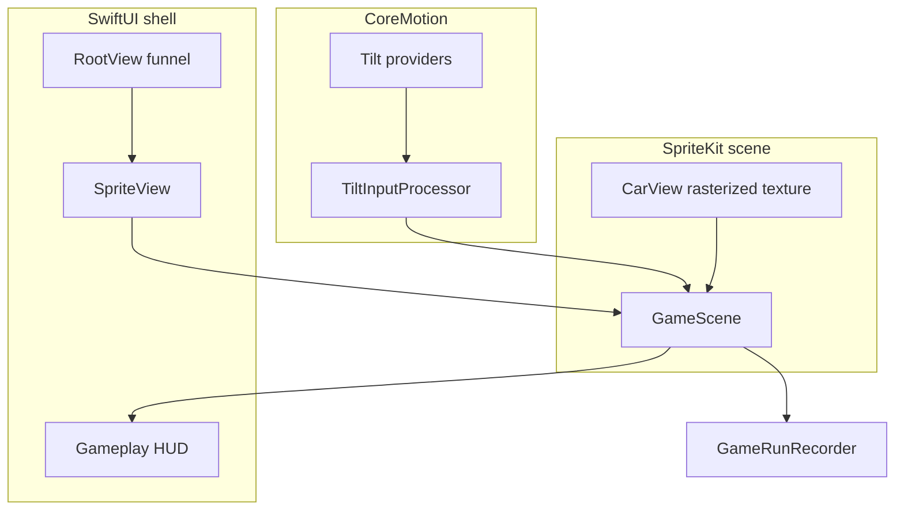

# Tight Rope Car

Drive a car across a tight rope. Tilt your iPhone or iPad left and right to balance — lean too far and you fall.

## Concept

You are a car inching forward along a rope high above the ground. The only control is **balance**: tilting the device left makes the car lean and drift left; tilting right does the opposite. Stay centered, keep your pitch stable, and reach the end without tumbling off.

## Controls

| Input | Effect |
|-------|--------|
| Tilt left | Car leans / moves left on the rope |
| Tilt right | Car leans / moves right on the rope |
| Hold level | Neutral balance (calibrated at level start) |
| On-screen balance | Left/right nudge buttons when Reduce Motion is on or in Simulator |

A physical device is recommended for playtesting; the Simulator uses on-screen balance controls.

## Core gameplay loop

| Phase | Behavior |
|-------|----------|
| **Start** | Car spawns on the rope; brief calibration (“hold your device level”) |
| **Play** | Continuous forward motion; player corrects roll via tilt |
| **Fail** | Center of mass leaves the rope, or pitch exceeds stability threshold |
| **Success** | Cross the finish line; score by time, distance, and tickets collected |

## Feature status

### MVP (v0.1)

- [x] Course-based levels (200-track map with unlock progression)
- [x] CoreMotion tilt input with dead zone and smoothing
- [x] SpriteKit side view: car, rope path, parallax backgrounds
- [x] Fall detection, results screen, per-course high scores (SwiftData)

### v0.2 — Game feel

- [x] Haptics on near-fall and fall (UIKit impact feedback)
- [x] Gameplay SFX: fall sting, run success, ticket pickup
- [x] Theme ambience loops during runs (`.ambient` session; respects silent switch)
- [x] Engine loop + rope creak (`GameplayLoopSFXPlayer` + near-fall `rope_creak` one-shot; Reduce Motion does not mute audio)
- [x] Wind gusts as periodic lateral force
- [x] Cosmetic rope sway (visual only; hitbox uses sampler geometry)

### v0.3 — Progression

- [x] Level select: 200-node course map, per-course rope geometry and wind
- [ ] Star rating (time, max tilt, falls) — not implemented
- [x] Map cleared state only (`CLEAR` chip, checkmark seal on beaten nodes — not 1–3 performance stars)
- [x] Local persistence: profiles, unlocks, high scores, ticket totals

### Later (optional)

- [ ] Game Center leaderboards and achievements
- [ ] iCloud sync for progress
- [x] Accessibility: on-screen left/right balance
- [x] iPad: adaptive layouts for map, garage, and gameplay

## Garage

Fifteen selectable die-cast silhouettes live in `CarCatalog` (IDs match `CarDesign`). Legacy color-car IDs (`blaze`, `volt`, …) migrate automatically. In-run cars rasterize from the same `CarView` art as the garage.

## Level backgrounds

Eight themes (ocean, forest, city, bedroom, toy shop, candy shop, garden, beach) with 24 parallax layers in the asset catalog. Import pipeline: `scripts/import_parallax_graphics.sh`. Bundled ambience: `ocean_waves`, `forest_birds`, `city_traffic`, `toy_shop_chimes`, `garden_breeze`, `beach_waves` (bedroom and candy shop are silent). Loops play in the **Backgrounds** gallery and during gameplay when a theme provides a clip. See [docs/background-themes.md](docs/background-themes.md) and [docs/background-art.md](docs/background-art.md).

## Technical architecture

Native **iOS / iPadOS** app: SwiftUI shell (`RootView` funnel), SpriteKit playfield (`GameSceneView` → `GameScene`), SwiftData for profiles and scores, CoreMotion tilt, AVFoundation audio.



See [docs/systems-overview.md](docs/systems-overview.md) for the full input → scene → recorder flow.

## Game design notes

Implementation constants (see [docs/gameplay-tuning.md](docs/gameplay-tuning.md)):

- **Input mapping** — Device roll drives a filtered lean angle via `TiltInputProcessor` using `tiltSmoothingNewSampleWeight`, `tiltDeadZoneRadians`, and `tiltFilterTargetHz`.
- **Auto-forward** — `Course.forwardSpeed` (catalog); tilt affects lateral balance via `lateralAccelerationFromTilt`, not throttle.
- **Stability** — `BalanceStabilityEvaluator` + `ropeHalfWidth(at:)` and `Course.maxPitchRadians`; `lateralFallThresholdOfHalfWidth` and `pitchFallUsesInclusiveLimit` control fall edges.
- **Difficulty knobs** — Per-course rope width, wind (`WindGustSimulator`), forward speed, style spans; global feel in `GameBalanceConstants`.
- **Fairness** — Run-start calibration (`calibrationRequiredSamples`, `calibrationMaxRollVariance`); pause stops scene updates and tilt (`GameplayView` phase → `GameSceneView.isPaused`).
- **Rope visuals** — `RopePathBuilder` draws styled segments with optional `ropeVisualSway*` (cosmetic; hitbox unchanged).

## Getting started

### Requirements

- Xcode with an iOS SDK matching the project deployment target
- iPhone or iPad for tilt testing

### Open the project

```bash
open "Tight Rope Car.xcodeproj"
```

Build and run on a device. Use **Product → Run** with your phone selected as the destination.

### Tests

```bash
xcodebuild test -scheme "Tight Rope Car" \
  -destination 'platform=iOS Simulator,name=iPhone 17,OS=26.5' \
  -derivedDataPath /tmp/TightRopeCarDerived
```

Targeted simulation tests:

```bash
-only-testing:'Tight Rope CarTests/GameRunPhysicsTests' \
-only-testing:'Tight Rope CarTests/RopePathBuilderTests'
```

## Project status

Playable build: landing → profiles → 15-car garage → 200-course map → SpriteKit runs with tilt, calibration, wind, segmented rope rendering, tickets, haptics, SFX, theme parallax and ambience, SwiftData progress, map integrity validation, and share/export. Simulation tuning is centralized in `GameBalanceConstants` ([docs/gameplay-tuning.md](docs/gameplay-tuning.md)).

## License

MIT License — see [LICENSE](LICENSE).

## Contributing

Issues and pull requests are welcome. For larger changes, open an issue first to align on scope.
