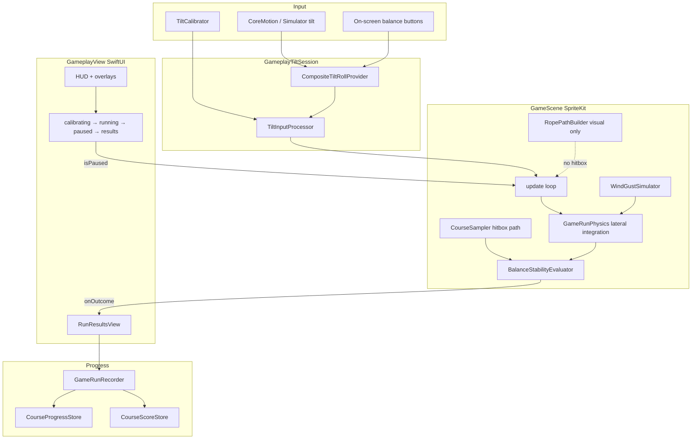

# Systems overview

High-level gameplay data flow for **Tight Rope Car**. SwiftUI owns menus and run phase; SpriteKit owns the live simulation frame loop.

## Run phases

| Phase | Scene updates | Tilt input |
|-------|---------------|------------|
| Calibrating | Paused | Calibration samples only |
| Running | Active | Device and/or on-screen balance |
| Paused | Paused | Ignored (decay toward level) |
| Results | Paused | Ignored |

## Related docs

- [ui-layout.md](ui-layout.md) — safe areas, screen backgrounds, shared layout modifiers
- [gameplay-tuning.md](gameplay-tuning.md) — all `GameBalanceConstants` knobs
- [background-themes.md](background-themes.md) — parallax themes per course
